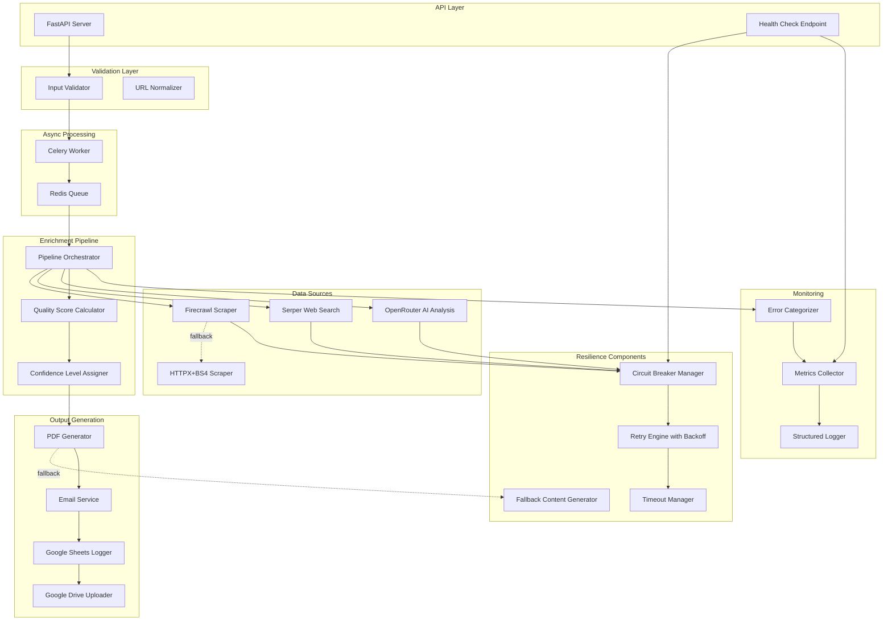
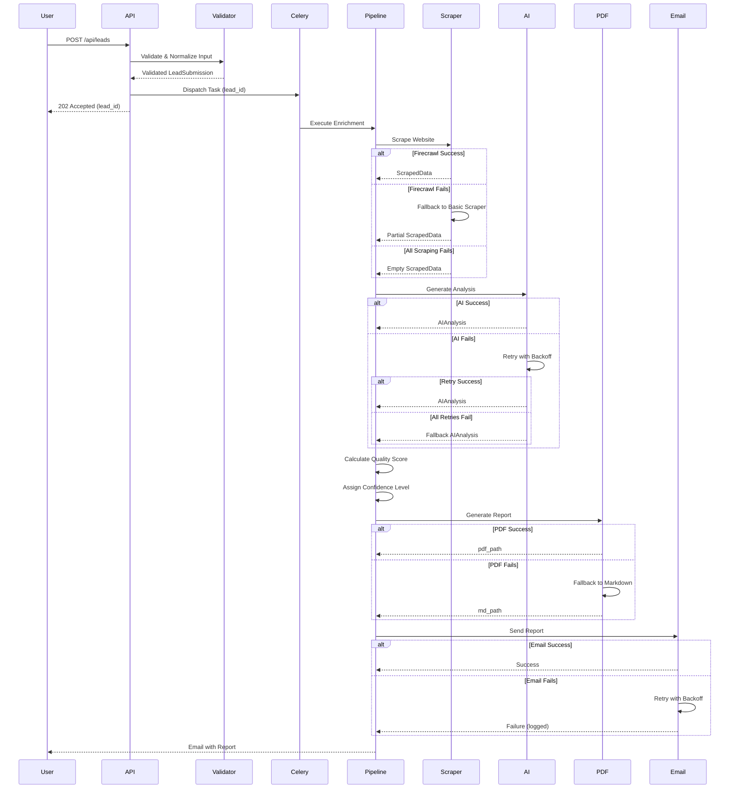
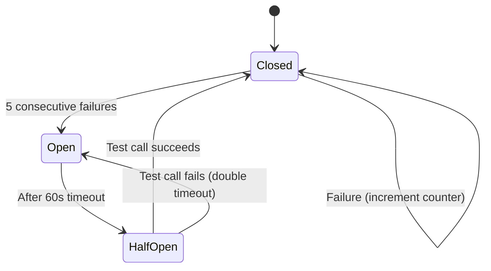
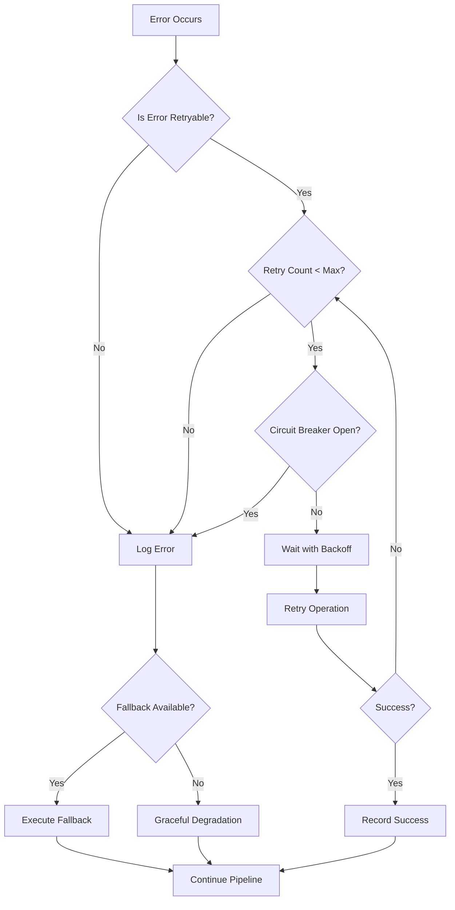

# Design Document: Production-Grade Resilience and Error Handling

## Overview

This design document specifies the architecture and implementation strategy for transforming the Lead Autopilot system from a demonstration-grade application into a production-ready platform with comprehensive resilience, error handling, and graceful degradation capabilities.

### Current State

The Lead Autopilot system currently implements a "happy path" pipeline that:
- Accepts lead submissions via REST API
- Scrapes company websites using Firecrawl (primary) and HTTPX+BeautifulSoup (fallback)
- Performs web searches via Serper API for additional context
- Generates AI-powered analysis using OpenRouter (Qwen model)
- Creates professional PDF reports using WeasyPrint
- Delivers reports via SMTP email
- Logs leads to Google Sheets and archives PDFs to Google Drive
- Processes all operations asynchronously using Celery workers

### Problem Statement

The current implementation lacks production-grade resilience:
- Single component failures cause complete pipeline failures
- No graceful degradation when data sources are unavailable
- Limited retry logic and error recovery mechanisms
- No confidence indicators for partial data scenarios
- Insufficient monitoring and observability
- No circuit breaker patterns for failing external services
- Limited timeout management across components

### Design Goals

1. **Resilience**: System continues operating and delivering value even when individual components fail
2. **Graceful Degradation**: Generate partial reports with clear confidence indicators when data is incomplete
3. **Professional Error Handling**: Translate technical failures into user-friendly messaging
4. **Observability**: Comprehensive logging, metrics, and health monitoring
5. **Reliability**: Intelligent retry logic, circuit breakers, and timeout management
6. **Data Quality**: Automated scoring and confidence level assignment
7. **Idempotency**: Safe retry operations without data corruption or duplication


## Architecture

### High-Level System Architecture




### Component Interaction Flow




## Data Models

### Quality Scoring Model

```python
class QualityScoreComponents(BaseModel):
    """Breakdown of quality score calculation."""
    
    scraped_data_score: float = Field(ge=0.0, le=0.40, description="Score from scraped data completeness")
    ai_analysis_score: float = Field(ge=0.0, le=0.45, description="Score from AI analysis completeness")
    web_search_score: float = Field(ge=0.0, le=0.15, description="Score from web search availability")
    total_score: float = Field(ge=0.0, le=1.0, description="Combined quality score")
    
    # Detailed breakdown
    has_title: bool = False
    has_meta_description: bool = False
    has_hero_text: bool = False
    has_about_text: bool = False
    has_services: bool = False
    has_tech_stack: bool = False
    has_social_links: bool = False
    has_contact_info: bool = False
    
    has_executive_summary: bool = False
    has_swot: bool = False
    has_action_roadmap: bool = False
    has_current_state: bool = False
    has_key_findings: bool = False
    has_risk_areas: bool = False
    
    has_web_search_context: bool = False


class ConfidenceLevel(str, Enum):
    """Categorical confidence indicator."""
    HIGH = "High"
    MEDIUM = "Medium"
    LOW = "Low"


class ConfidenceMetadata(BaseModel):
    """Detailed confidence information."""
    
    level: ConfidenceLevel
    score: float = Field(ge=0.0, le=1.0)
    reason: str
    missing_data_sources: list[str] = Field(default_factory=list)
    available_data_sources: list[str] = Field(default_factory=list)
    degradation_applied: bool = False
    degradation_reason: Optional[str] = None
```


### Error Tracking Model

```python
class ErrorCategory(str, Enum):
    """Standardized error categories for monitoring."""
    INPUT_VALIDATION = "input_validation"
    SCRAPING_BLOCKED = "scraping_blocked"
    SCRAPING_TIMEOUT = "scraping_timeout"
    AI_TIMEOUT = "ai_timeout"
    AI_INVALID_RESPONSE = "ai_invalid_response"
    PDF_RENDERING = "pdf_rendering"
    EMAIL_SMTP = "email_smtp"
    API_RATE_LIMIT = "api_rate_limit"
    API_UNAVAILABLE = "api_unavailable"
    CIRCUIT_BREAKER_OPEN = "circuit_breaker_open"
    UNKNOWN = "unknown"


class ErrorEvent(BaseModel):
    """Structured error event for logging and monitoring."""
    
    error_id: str = Field(default_factory=lambda: str(uuid.uuid4())[:8])
    lead_id: str
    category: ErrorCategory
    component: str  # e.g., "scraper", "ai_analyzer", "pdf_generator"
    message: str
    technical_details: Optional[str] = None
    timestamp: datetime = Field(default_factory=datetime.utcnow)
    retry_attempt: int = 0
    recoverable: bool = True
    recovery_action: Optional[str] = None
    user_facing_message: str = ""


class ComponentHealth(BaseModel):
    """Health status for a single component."""
    
    component_name: str
    status: Literal["healthy", "degraded", "unhealthy"]
    last_check: datetime
    response_time_ms: Optional[float] = None
    error_rate: float = Field(ge=0.0, le=1.0, description="Error rate in last hour")
    circuit_breaker_state: Literal["closed", "open", "half_open"] = "closed"
    consecutive_failures: int = 0
    last_error: Optional[str] = None
```


### Enhanced Pipeline Status Model

```python
class PipelineStepStatus(BaseModel):
    """Detailed status for a single pipeline step."""
    
    step: PipelineStep
    status: Literal["pending", "running", "completed", "failed", "skipped"]
    started_at: Optional[datetime] = None
    completed_at: Optional[datetime] = None
    duration_ms: Optional[float] = None
    error: Optional[ErrorEvent] = None
    retry_count: int = 0
    degraded: bool = False


class EnhancedLeadStatus(BaseModel):
    """Enhanced lead status with detailed tracking."""
    
    lead_id: str
    company_name: str
    email: str
    
    current_step: PipelineStep
    step_statuses: dict[str, PipelineStepStatus] = Field(default_factory=dict)
    
    quality_score: Optional[QualityScoreComponents] = None
    confidence: Optional[ConfidenceMetadata] = None
    
    errors: list[ErrorEvent] = Field(default_factory=list)
    warnings: list[str] = Field(default_factory=list)
    
    pdf_path: Optional[str] = None
    email_sent: bool = False
    
    created_at: datetime = Field(default_factory=datetime.utcnow)
    completed_at: Optional[datetime] = None
    total_duration_ms: Optional[float] = None
    
    # Idempotency tracking
    is_retry: bool = False
    original_lead_id: Optional[str] = None
```


## Components and Interfaces

### 1. Input Validation Service

**Purpose**: Validate and normalize all lead inputs before processing.

**Interface**:
```python
class InputValidationService:
    """Validates and normalizes lead submission data."""
    
    def validate_lead(self, lead: LeadSubmission) -> tuple[bool, list[str]]:
        """
        Validate a lead submission.
        
        Returns:
            (is_valid, warnings) - Always returns True with warnings for graceful degradation
        """
        pass
    
    def normalize_url(self, url: str) -> Optional[str]:
        """
        Normalize a URL by adding scheme and validating format.
        Returns None if URL is invalid.
        """
        pass
    
    def sanitize_text_input(self, text: str) -> str:
        """Remove potentially harmful characters from text inputs."""
        pass
    
    def check_duplicate_submission(
        self, 
        email: str, 
        company: str, 
        window_hours: int = 24
    ) -> Optional[str]:
        """
        Check for duplicate submissions within time window.
        Returns existing lead_id if found, None otherwise.
        """
        pass
```

**Implementation Details**:
- Uses `validators` library for email validation (RFC 5322)
- URL normalization adds `https://` scheme if missing
- Checks for common URL typos (e.g., "ww.example.com" → "www.example.com")
- Sanitizes text inputs to prevent XSS and injection attacks
- Queries database for duplicate submissions using email+company hash
- Never rejects submissions - always proceeds with warnings


### 2. Resilient Scraping Service

**Purpose**: Scrape company websites with multiple fallback strategies.

**Interface**:
```python
class ResilientScraperService:
    """Multi-strategy web scraping with graceful fallbacks."""
    
    def __init__(self):
        self.firecrawl_client = FirecrawlClient()
        self.basic_scraper = BasicScraper()
        self.playwright_scraper = PlaywrightScraper()
        self.circuit_breaker = CircuitBreaker()
        self.timeout_manager = TimeoutManager()
    
    async def scrape_with_fallbacks(
        self, 
        url: str, 
        lead_id: str
    ) -> tuple[ScrapedData, list[str]]:
        """
        Attempt scraping with multiple strategies.
        
        Strategy order:
        1. Firecrawl (if circuit breaker closed)
        2. Basic HTTPX+BeautifulSoup
        3. Playwright (for JS-heavy sites)
        4. Metadata-only fallback
        
        Returns:
            (scraped_data, warnings)
        """
        pass
    
    async def _scrape_with_firecrawl(self, url: str) -> Optional[ScrapedData]:
        """Primary scraping strategy using Firecrawl API."""
        pass
    
    async def _scrape_with_basic(self, url: str) -> Optional[ScrapedData]:
        """Fallback scraping using HTTPX + BeautifulSoup."""
        pass
    
    async def _scrape_with_playwright(self, url: str) -> Optional[ScrapedData]:
        """JS-aware scraping for dynamic sites."""
        pass
    
    async def _extract_metadata_only(self, url: str) -> ScrapedData:
        """Last resort: extract domain metadata and social links."""
        pass
```

**Implementation Details**:
- Timeout: 30 seconds per scraping attempt
- Retry logic: 3 attempts with exponential backoff (1s, 2s, 4s)
- Circuit breaker: Opens after 5 consecutive Firecrawl failures
- User agent rotation to avoid bot detection
- Respects robots.txt for ethical scraping
- Logs all scraping attempts with status codes and response times


### 3. Resilient AI Analysis Service

**Purpose**: Generate AI analysis with schema validation and fallback content.

**Interface**:
```python
class ResilientAIAnalysisService:
    """AI analysis with validation and fallback strategies."""
    
    def __init__(self):
        self.client = AsyncOpenAI(base_url="https://openrouter.ai/api/v1")
        self.schema_validator = SchemaValidator()
        self.fallback_generator = FallbackContentGenerator()
        self.circuit_breaker = CircuitBreaker()
    
    async def analyze_with_validation(
        self,
        company_name: str,
        industry: str,
        website_url: str,
        scraped: ScrapedData,
        web_search_context: str = "",
        lead_id: str = ""
    ) -> tuple[AIAnalysis, list[str]]:
        """
        Generate AI analysis with schema validation.
        
        Returns:
            (analysis, warnings)
        """
        pass
    
    async def _generate_analysis(
        self, 
        prompt: str, 
        retry_count: int = 0
    ) -> dict:
        """Call OpenRouter API with retry logic."""
        pass
    
    def _validate_response(self, response: dict) -> tuple[bool, list[str]]:
        """Validate AI response against AIAnalysis schema."""
        pass
    
    async def _generate_fallback_analysis(
        self,
        company_name: str,
        industry: str,
        scraped: ScrapedData
    ) -> AIAnalysis:
        """Generate minimal analysis when AI fails."""
        pass
    
    def _detect_repetitive_content(self, text: str) -> bool:
        """Detect if AI generated repetitive/hallucinated content."""
        pass
```

**Implementation Details**:
- Timeout: 45 seconds per API call
- Retry logic: 2 retries with exponential backoff (2s, 4s)
- Schema validation using Pydantic models
- Detects repetitive text (same sentence 3+ times)
- Respects rate limit headers (Retry-After)
- Circuit breaker: Opens after 5 consecutive failures
- Fallback content uses industry templates and scraped metadata


### 4. Quality Score Calculator

**Purpose**: Calculate data quality scores based on completeness.

**Interface**:
```python
class QualityScoreCalculator:
    """Calculates quality scores from enriched data."""
    
    # Scoring weights
    SCRAPED_DATA_WEIGHT = 0.40
    AI_ANALYSIS_WEIGHT = 0.45
    WEB_SEARCH_WEIGHT = 0.15
    
    def calculate_score(
        self,
        scraped: ScrapedData,
        analysis: AIAnalysis,
        has_web_search: bool
    ) -> QualityScoreComponents:
        """
        Calculate comprehensive quality score.
        
        Returns detailed breakdown of score components.
        """
        pass
    
    def _score_scraped_data(self, scraped: ScrapedData) -> float:
        """
        Score scraped data completeness (0.0 - 0.40).
        
        Breakdown:
        - title: 0.05
        - meta_description: 0.05
        - hero_text: 0.03
        - about_text: 0.10
        - services: 0.07
        - tech_stack: 0.03
        - social_links: 0.04
        - contact_info: 0.03
        """
        pass
    
    def _score_ai_analysis(self, analysis: AIAnalysis) -> float:
        """
        Score AI analysis completeness (0.0 - 0.45).
        
        Breakdown:
        - executive_summary (>50 chars): 0.12
        - swot (has items): 0.08
        - action_roadmap (>=3 items): 0.15
        - current_state (>50 chars): 0.10
        - key_findings: 0.05
        - risk_areas: 0.05
        """
        pass
    
    def _score_web_search(self, has_search: bool) -> float:
        """Score web search availability (0.0 - 0.15)."""
        pass
```


### 5. Confidence Level Assigner

**Purpose**: Assign categorical confidence levels based on quality scores.

**Interface**:
```python
class ConfidenceLevelAssigner:
    """Assigns confidence levels and generates explanations."""
    
    # Thresholds
    HIGH_THRESHOLD = 0.80
    MEDIUM_THRESHOLD = 0.40
    
    def assign_confidence(
        self,
        quality_score: QualityScoreComponents,
        errors: list[ErrorEvent]
    ) -> ConfidenceMetadata:
        """
        Assign confidence level based on quality score and errors.
        
        Levels:
        - High: score >= 0.80, no critical errors
        - Medium: score >= 0.40, some data available
        - Low: score < 0.40, significant data gaps
        """
        pass
    
    def _generate_confidence_reason(
        self,
        level: ConfidenceLevel,
        quality_score: QualityScoreComponents,
        errors: list[ErrorEvent]
    ) -> str:
        """Generate user-friendly explanation of confidence level."""
        pass
    
    def _identify_missing_sources(
        self,
        quality_score: QualityScoreComponents
    ) -> list[str]:
        """Identify which data sources failed or returned no data."""
        pass
    
    def _identify_available_sources(
        self,
        quality_score: QualityScoreComponents
    ) -> list[str]:
        """Identify which data sources succeeded."""
        pass
```

**Confidence Level Criteria**:

| Level | Score Range | Criteria |
|-------|-------------|----------|
| High | 0.80 - 1.00 | Comprehensive data from all sources, no critical errors |
| Medium | 0.40 - 0.79 | Partial data available, some sources failed |
| Low | 0.00 - 0.39 | Minimal data, multiple source failures |


### 6. Resilient PDF Generation Service

**Purpose**: Generate PDF reports with fallback strategies.

**Interface**:
```python
class ResilientPDFGenerationService:
    """PDF generation with multiple fallback strategies."""
    
    def __init__(self):
        self.template_engine = Jinja2Environment()
        self.pdf_renderer = WeasyPrint()
        self.markdown_generator = MarkdownGenerator()
        self.timeout_manager = TimeoutManager()
    
    async def generate_with_fallbacks(
        self,
        enriched: EnrichedCompanyData,
        confidence: ConfidenceMetadata,
        lead_id: str
    ) -> tuple[str, str]:
        """
        Generate report with fallback strategies.
        
        Strategy order:
        1. Full PDF with WeasyPrint
        2. Simplified PDF (reduced template)
        3. Markdown report
        4. Plain text report
        
        Returns:
            (file_path, file_type) where file_type is "pdf", "md", or "txt"
        """
        pass
    
    async def _generate_full_pdf(
        self,
        enriched: EnrichedCompanyData,
        confidence: ConfidenceMetadata
    ) -> Optional[str]:
        """Generate full PDF with all features."""
        pass
    
    async def _generate_simplified_pdf(
        self,
        enriched: EnrichedCompanyData,
        confidence: ConfidenceMetadata
    ) -> Optional[str]:
        """Generate PDF with simplified template (no complex CSS)."""
        pass
    
    async def _generate_markdown_report(
        self,
        enriched: EnrichedCompanyData,
        confidence: ConfidenceMetadata
    ) -> str:
        """Generate markdown report as fallback."""
        pass
    
    def _validate_pdf(self, pdf_path: str) -> bool:
        """Validate that PDF is not corrupted."""
        pass
    
    def _sanitize_html(self, html: str) -> str:
        """Remove problematic HTML that might break rendering."""
        pass
```


### 7. Resilient Email Service

**Purpose**: Deliver reports via email with retry logic and validation.

**Interface**:
```python
class ResilientEmailService:
    """Email delivery with retry logic and validation."""
    
    def __init__(self):
        self.smtp_client = SMTPClient()
        self.email_validator = EmailValidator()
        self.retry_engine = RetryEngine()
    
    async def send_with_retry(
        self,
        to_email: str,
        prospect_name: str,
        company_name: str,
        industry: str,
        report_path: str,
        confidence: ConfidenceMetadata,
        lead_id: str
    ) -> tuple[bool, Optional[str]]:
        """
        Send email with retry logic.
        
        Returns:
            (success, error_message)
        """
        pass
    
    def _validate_email_address(self, email: str) -> bool:
        """Validate email format and domain."""
        pass
    
    async def _send_email_attempt(
        self,
        to_email: str,
        subject: str,
        html_body: str,
        attachment_path: str
    ) -> None:
        """Single email send attempt."""
        pass
    
    def _build_email_body(
        self,
        prospect_name: str,
        company_name: str,
        industry: str,
        confidence: ConfidenceMetadata
    ) -> str:
        """Build HTML email body with confidence indicators."""
        pass
    
    def _handle_attachment_size(
        self,
        attachment_path: str,
        max_size_mb: int = 10
    ) -> tuple[str, bool]:
        """
        Handle large attachments.
        
        Returns:
            (path_or_link, is_direct_attachment)
        """
        pass
```

**Implementation Details**:
- Timeout: 15 seconds per SMTP connection
- Retry logic: 3 attempts with exponential backoff (2s, 4s, 8s)
- Email validation using `email-validator` library
- Attachment size limit: 10MB (falls back to Drive link)
- Connection pooling for multiple emails
- Logs message IDs for tracking


### 8. Circuit Breaker Manager

**Purpose**: Prevent cascading failures by temporarily disabling failing services.

**Interface**:
```python
class CircuitBreakerManager:
    """Manages circuit breakers for external services."""
    
    def __init__(self):
        self.breakers: dict[str, CircuitBreakerState] = {}
        self.failure_threshold = 5
        self.timeout_seconds = 60
        self.half_open_timeout = 30
    
    def call_with_breaker(
        self,
        service_name: str,
        func: Callable,
        *args,
        **kwargs
    ) -> Any:
        """
        Execute function with circuit breaker protection.
        
        States:
        - CLOSED: Normal operation, calls pass through
        - OPEN: Service failing, calls immediately return fallback
        - HALF_OPEN: Testing if service recovered
        """
        pass
    
    def record_success(self, service_name: str) -> None:
        """Record successful call, potentially closing breaker."""
        pass
    
    def record_failure(self, service_name: str) -> None:
        """Record failed call, potentially opening breaker."""
        pass
    
    def get_state(self, service_name: str) -> CircuitBreakerState:
        """Get current state of circuit breaker."""
        pass
    
    def force_open(self, service_name: str) -> None:
        """Manually open circuit breaker (for maintenance)."""
        pass
    
    def force_close(self, service_name: str) -> None:
        """Manually close circuit breaker (after recovery)."""
        pass


class CircuitBreakerState(BaseModel):
    """State of a circuit breaker."""
    
    service_name: str
    state: Literal["closed", "open", "half_open"]
    failure_count: int = 0
    last_failure_time: Optional[datetime] = None
    opened_at: Optional[datetime] = None
    last_success_time: Optional[datetime] = None
```

**Circuit Breaker Behavior**:




### 9. Retry Engine with Exponential Backoff

**Purpose**: Provide intelligent retry logic for transient failures.

**Interface**:
```python
class RetryEngine:
    """Configurable retry engine with exponential backoff and jitter."""
    
    def __init__(
        self,
        max_retries: int = 3,
        base_delay: float = 1.0,
        max_delay: float = 10.0,
        jitter: bool = True
    ):
        self.max_retries = max_retries
        self.base_delay = base_delay
        self.max_delay = max_delay
        self.jitter = jitter
    
    async def execute_with_retry(
        self,
        func: Callable,
        *args,
        retryable_exceptions: tuple = (Exception,),
        non_retryable_exceptions: tuple = (),
        **kwargs
    ) -> Any:
        """
        Execute function with retry logic.
        
        Args:
            func: Async function to execute
            retryable_exceptions: Exceptions that trigger retry
            non_retryable_exceptions: Exceptions that abort immediately
        """
        pass
    
    def _calculate_delay(self, attempt: int) -> float:
        """
        Calculate delay for retry attempt with exponential backoff.
        
        Formula: min(base_delay * (2 ** attempt), max_delay)
        Adds jitter: delay * (0.5 + random.random() * 0.5)
        """
        pass
    
    def _is_retryable_error(
        self,
        error: Exception,
        retryable: tuple,
        non_retryable: tuple
    ) -> bool:
        """Determine if error should trigger retry."""
        pass
    
    def _extract_retry_after(self, error: Exception) -> Optional[float]:
        """Extract Retry-After header from API rate limit errors."""
        pass


# Decorator for easy retry application
def with_retry(
    max_retries: int = 3,
    base_delay: float = 1.0,
    max_delay: float = 10.0
):
    """Decorator for adding retry logic to async functions."""
    def decorator(func):
        @wraps(func)
        async def wrapper(*args, **kwargs):
            engine = RetryEngine(max_retries, base_delay, max_delay)
            return await engine.execute_with_retry(func, *args, **kwargs)
        return wrapper
    return decorator
```


### 10. Timeout Manager

**Purpose**: Enforce timeouts across all long-running operations.

**Interface**:
```python
class TimeoutManager:
    """Centralized timeout management for all operations."""
    
    # Default timeouts (seconds)
    TIMEOUTS = {
        "scraping": 30,
        "ai_analysis": 45,
        "pdf_generation": 20,
        "email_send": 15,
        "web_search": 10,
        "sheets_log": 10,
        "drive_upload": 30,
        "total_pipeline": 120
    }
    
    def __init__(self):
        self.timeouts = self.TIMEOUTS.copy()
        self._load_from_env()
    
    async def execute_with_timeout(
        self,
        operation: str,
        func: Callable,
        *args,
        **kwargs
    ) -> Any:
        """
        Execute function with timeout.
        
        Raises:
            asyncio.TimeoutError: If operation exceeds timeout
        """
        pass
    
    def get_timeout(self, operation: str) -> float:
        """Get timeout value for operation."""
        pass
    
    def set_timeout(self, operation: str, seconds: float) -> None:
        """Override timeout for operation."""
        pass
    
    def _load_from_env(self) -> None:
        """Load timeout overrides from environment variables."""
        pass


# Context manager for timeout enforcement
class TimeoutContext:
    """Context manager for timeout enforcement."""
    
    def __init__(self, timeout_seconds: float, operation_name: str):
        self.timeout = timeout_seconds
        self.operation = operation_name
        self.start_time = None
    
    async def __aenter__(self):
        self.start_time = time.time()
        return self
    
    async def __aexit__(self, exc_type, exc_val, exc_tb):
        elapsed = time.time() - self.start_time
        if elapsed > self.timeout:
            logger.warning(
                f"Operation '{self.operation}' exceeded timeout: "
                f"{elapsed:.2f}s > {self.timeout}s"
            )
```


### 11. Error Categorizer and Logger

**Purpose**: Categorize, log, and track errors systematically.

**Interface**:
```python
class ErrorCategorizerService:
    """Categorizes and logs errors with structured metadata."""
    
    def __init__(self):
        self.logger = logging.getLogger("lead-autopilot.errors")
        self.metrics_collector = MetricsCollector()
    
    def categorize_and_log(
        self,
        error: Exception,
        lead_id: str,
        component: str,
        context: dict = None
    ) -> ErrorEvent:
        """
        Categorize error and create structured log entry.
        
        Returns:
            ErrorEvent with category, user message, and recovery action
        """
        pass
    
    def _categorize_error(self, error: Exception, component: str) -> ErrorCategory:
        """Determine error category from exception type and context."""
        pass
    
    def _generate_user_message(
        self,
        category: ErrorCategory,
        component: str
    ) -> str:
        """Generate user-friendly error message."""
        pass
    
    def _suggest_recovery_action(
        self,
        category: ErrorCategory,
        component: str
    ) -> Optional[str]:
        """Suggest recovery action for error."""
        pass
    
    def _is_recoverable(self, category: ErrorCategory) -> bool:
        """Determine if error is recoverable."""
        pass


class MetricsCollector:
    """Collects and aggregates error metrics."""
    
    def __init__(self):
        self.error_counts: dict[ErrorCategory, int] = defaultdict(int)
        self.component_errors: dict[str, list[ErrorEvent]] = defaultdict(list)
        self.hourly_stats: dict[datetime, dict] = {}
    
    def record_error(self, error_event: ErrorEvent) -> None:
        """Record error for metrics tracking."""
        pass
    
    def get_error_rate(
        self,
        component: str,
        window_hours: int = 1
    ) -> float:
        """Calculate error rate for component."""
        pass
    
    def get_error_summary(self) -> dict:
        """Get summary of all errors."""
        pass
```


### 12. Health Check Service

**Purpose**: Monitor system health and external dependencies.

**Interface**:
```python
class HealthCheckService:
    """Comprehensive health monitoring for all dependencies."""
    
    def __init__(self):
        self.circuit_breaker_manager = CircuitBreakerManager()
        self.metrics_collector = MetricsCollector()
        self.cache_ttl = 30  # seconds
        self.last_check: Optional[datetime] = None
        self.cached_health: Optional[dict] = None
    
    async def check_all_dependencies(self) -> dict:
        """
        Check health of all external dependencies.
        
        Returns:
            {
                "status": "healthy" | "degraded" | "unhealthy",
                "timestamp": "2024-01-15T10:30:00Z",
                "dependencies": {
                    "openrouter": ComponentHealth(...),
                    "firecrawl": ComponentHealth(...),
                    ...
                },
                "overall_health_score": 0.85
            }
        """
        pass
    
    async def _check_openrouter(self) -> ComponentHealth:
        """Check OpenRouter API health."""
        pass
    
    async def _check_firecrawl(self) -> ComponentHealth:
        """Check Firecrawl API health."""
        pass
    
    async def _check_serper(self) -> ComponentHealth:
        """Check Serper web search API health."""
        pass
    
    async def _check_smtp(self) -> ComponentHealth:
        """Check SMTP server connectivity."""
        pass
    
    async def _check_google_sheets(self) -> ComponentHealth:
        """Check Google Sheets API health."""
        pass
    
    async def _check_google_drive(self) -> ComponentHealth:
        """Check Google Drive API health."""
        pass
    
    async def _check_redis(self) -> ComponentHealth:
        """Check Redis connectivity."""
        pass
    
    async def _check_database(self) -> ComponentHealth:
        """Check database connectivity."""
        pass
    
    def _calculate_overall_health(
        self,
        dependencies: dict[str, ComponentHealth]
    ) -> tuple[str, float]:
        """
        Calculate overall system health.
        
        Returns:
            (status, score) where status is "healthy", "degraded", or "unhealthy"
        """
        pass
```


### 13. Fallback Content Generator

**Purpose**: Generate professional fallback content when primary sources fail.

**Interface**:
```python
class FallbackContentGenerator:
    """Generates fallback content for degraded scenarios."""
    
    def __init__(self):
        self.industry_templates = self._load_industry_templates()
        self.generic_templates = self._load_generic_templates()
    
    def generate_fallback_analysis(
        self,
        company_name: str,
        industry: str,
        scraped: ScrapedData,
        available_data: list[str]
    ) -> AIAnalysis:
        """
        Generate fallback AI analysis when primary AI fails.
        
        Uses:
        - Industry-specific templates
        - Scraped metadata
        - Generic business insights
        """
        pass
    
    def generate_executive_summary(
        self,
        company_name: str,
        industry: str,
        scraped: ScrapedData
    ) -> str:
        """Generate fallback executive summary."""
        pass
    
    def generate_swot_from_metadata(
        self,
        company_name: str,
        industry: str,
        scraped: ScrapedData
    ) -> SWOTAnalysis:
        """Generate basic SWOT from available metadata."""
        pass
    
    def generate_action_roadmap(
        self,
        industry: str,
        tech_stack: list[str]
    ) -> list[ActionItem]:
        """Generate generic action roadmap for industry."""
        pass
    
    def _load_industry_templates(self) -> dict[str, dict]:
        """Load industry-specific content templates."""
        pass
    
    def _load_generic_templates(self) -> dict:
        """Load generic fallback templates."""
        pass
```

**Industry Templates Structure**:
```python
INDUSTRY_TEMPLATES = {
    "technology": {
        "executive_summary_template": "...",
        "common_strengths": ["Technical expertise", "Innovation focus"],
        "common_weaknesses": ["Market saturation", "Rapid change"],
        "opportunities": ["AI integration", "Cloud migration"],
        "threats": ["Cybersecurity risks", "Competition"],
        "action_items": [...]
    },
    "healthcare": {...},
    "finance": {...},
    "retail": {...},
    "manufacturing": {...}
}
```


## Error Handling

### Error Categorization Strategy

All errors are categorized into standardized types for consistent handling:

| Category | Description | Retryable | Recovery Strategy |
|----------|-------------|-----------|-------------------|
| INPUT_VALIDATION | Invalid or malformed input data | No | Proceed with warnings, normalize data |
| SCRAPING_BLOCKED | Bot detection or 403/429 responses | No | Fall back to metadata extraction |
| SCRAPING_TIMEOUT | Network timeout during scraping | Yes | Retry with exponential backoff |
| AI_TIMEOUT | OpenRouter API timeout | Yes | Retry with backoff, then fallback content |
| AI_INVALID_RESPONSE | LLM returned invalid JSON | Yes | Retry with schema examples |
| PDF_RENDERING | WeasyPrint rendering failure | Yes | Simplified template, then markdown |
| EMAIL_SMTP | SMTP connection or delivery failure | Yes | Retry with backoff |
| API_RATE_LIMIT | External API rate limit hit | Yes | Wait for Retry-After, then retry |
| API_UNAVAILABLE | External API down (503, connection error) | Yes | Circuit breaker, fallback content |
| CIRCUIT_BREAKER_OPEN | Service temporarily disabled | No | Use fallback immediately |
| UNKNOWN | Unexpected error | No | Log details, graceful degradation |

### Error Recovery Decision Tree



