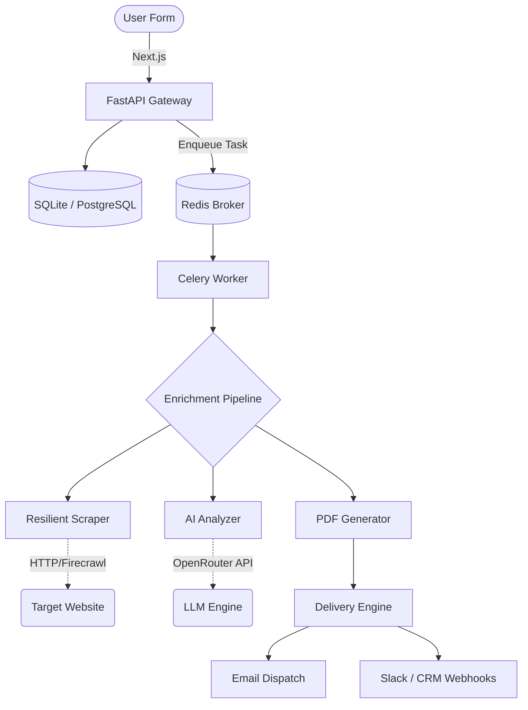

<div align="center">
  <h1>Lead Autopilot</h1>
  <p><strong>Enterprise-Grade Automated Business Intelligence & Lead Enrichment</strong></p>
  
  <p>
    <a href="#architecture">Architecture</a> •
    <a href="#core-features">Features</a> •
    <a href="#resilience-engineering">Resilience</a> •
    <a href="#quick-start">Quick Start</a> •
    <a href="#api-reference">API</a>
  </p>
</div>

---

## 📖 Overview

**Lead Autopilot** is an automated, AI-driven lead enrichment pipeline designed to transform raw business prospect data into highly actionable, 5-page PDF intelligence reports in seconds.

Built with Python (FastAPI/Celery) and Next.js, it employs a 5-layer enterprise architecture with multi-tier failovers, circuit breakers, and hallucination detection to guarantee pipeline continuity in production environments.

---

## ✨ Core Features

* **Intelligent Web Extraction**: Bypasses anti-scraping walls via a 3-tier fallback engine (Firecrawl API → httpx/BS4 → Metadata-only).
* **AI Business Analysis**: Uses OpenRouter (Qwen/LLaMA) to generate SWOT analyses, digital maturity scorecards, and actionable roadmaps.
* **Resilience Engineering**: Hand-rolled Circuit Breakers and Exponential Backoff engines protect all external API calls.
* **Hallucination Detection**: Content validators strictly ensure AI responses meet length, uniqueness, and structural Pydantic bounds.
* **Automated PDF Delivery**: Jinja2 & WeasyPrint compile rich HTML templates into personalized executive PDF briefs.
* **Asynchronous Webhooks**: Non-blocking Celery workers dispatch notifications to Slack and push data to CRM/Google Sheets.

---

## 🏗️ Architecture

Lead Autopilot follows a strict separation of concerns, decoupling the HTTP layer from business logic and external integrations.



---

## 🛡️ Resilience Engineering

This system was designed for the chaos of the open internet. It treats external failures as expected states rather than edge cases.

1. **Circuit Breakers**: If OpenRouter or Firecrawl fail 3 times consecutively, the breaker opens. Subsequent leads immediately fail over to structured industry-template fallbacks, preventing cascading queue timeouts.
2. **Quality Scoring**: A composite scoring engine rates the intelligence output (0.0 to 1.0) and assigns a Confidence Level (High, Medium, Low) to every report.
3. **Pydantic Hardening**: All AI outputs are forced through strict schema validators. If the LLM returns unstructured text, a secondary rescue parser attempts to extract JSON.

---

## 🚀 Quick Start

### Prerequisites
- macOS/Linux
- Python 3.11+
- Node.js 18+
- Redis (installed and running)

### 1. Installation

Clone the repository and run the setup script:

```bash
git clone https://github.com/your-org/lead-autopilot.git
cd lead-autopilot

# This will create venvs, install npm modules, and copy env templates
./scripts/setup.sh
```

### 2. Configuration

Edit the `backend/.env` file with your credentials. **You only need an OpenRouter API key to test the core pipeline.**
If SMTP credentials are omitted, the system will gracefully simulate email dispatch.

```env
OPENROUTER_API_KEY=sk-or-v1-...
DATABASE_URL=sqlite:///./leads.db
```

### 3. Start the Platform

Run the unified startup script. This will launch FastAPI, the Celery worker, and the Next.js frontend, routing output to dedicated log files.

```bash
./scripts/start_all.sh
```

- **Frontend Interface**: [http://localhost:5173](http://localhost:5173)
- **Backend API Docs**: [http://localhost:8000/docs](http://localhost:8000/docs)

---

## 📂 Project Structure

```text
lead-autopilot/
├── backend/
│   ├── core_models.py        # Centralized Pydantic schemas & enums
│   ├── main.py               # FastAPI application and endpoints
│   ├── tasks.py              # Celery worker definitions
│   ├── services/             # Core business logic (Scraping, AI, PDF)
│   ├── integrations/         # Webhooks, Sheets, Drive connectors
│   └── utils/                # Circuit breakers, retries, timeout decorators
├── frontend/
│   ├── src/app/              # Next.js App Router (React)
│   └── public/               # Static assets
├── scripts/                  # Unified start/setup bash scripts
└── docs/                     # Supplemental architecture documentation
```

---

## 🔌 API Reference

| Method | Endpoint | Description |
|--------|----------|-------------|
| `GET` | `/api/health` | System diagnostics & configuration status |
| `POST` | `/api/leads` | Submit a new lead for async processing |
| `GET` | `/api/leads/{id}/status` | Long-poll pipeline progress |
| `GET` | `/api/leads/{id}/pdf` | Download the generated intelligence report |

### Example Request

```bash
curl -X POST http://localhost:8000/api/leads \
  -H "Content-Type: application/json" \
  -d '{
    "name": "Jane Doe",
    "email": "jane@example.com",
    "company": "Vercel",
    "website": "https://vercel.com",
    "industry": "Cloud Infrastructure"
  }'
```

---

## 🔒 Security

* **No tracking**: The system does not phone home.
* **Ephemeral processing**: External keys and tokens are only held in memory.
* **Disabled SSL verification (Scraper)**: Explicitly disabled to allow scraping of misconfigured SMB websites without crashing the pipeline.

<div align="center">
  <i>Engineered for Reliability</i>
</div>
